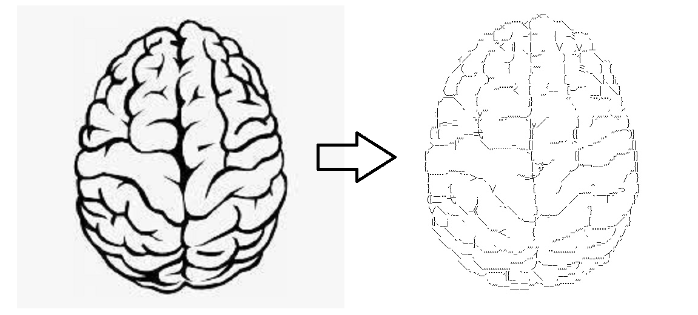
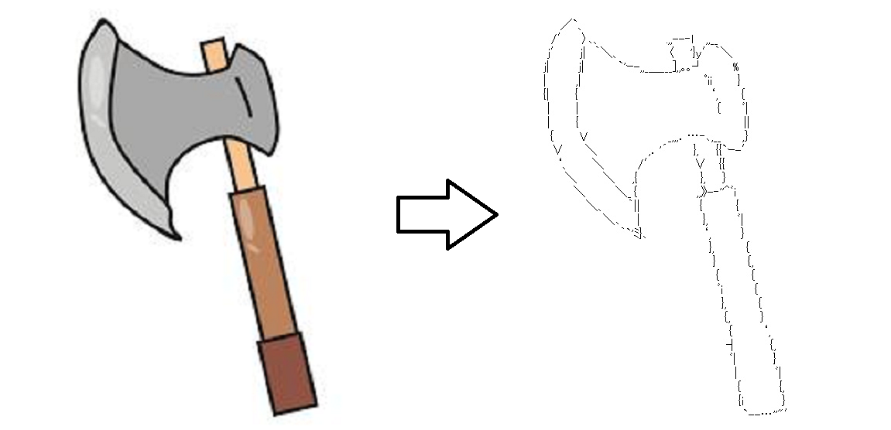
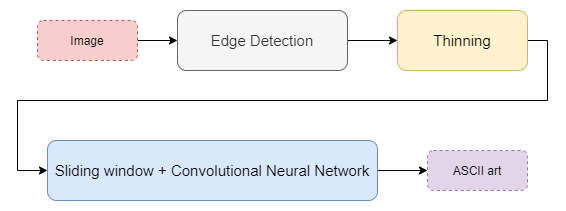

# ASCII Art Creator

Website: https://share.streamlit.io/inputblackboxoutput/ascii-art-creator/main/app.py

|||
|--|--|
|| |

## How to use the website?
1. Upload an image
1. Set input image width
1. Set the threshold such that optimal edges and thinned edges are observed
1. Click on the 'Generate ASCII art' button and wait for a while

## How it works?
1. Edges are detected from the image using dilation followed by subtraction with the original image
1. Thinning operation is performed on the edges using Guo-Hall thinning algorithm
1. Sub-images are obtained by using the sliding window technique and then passed to a CNN which determines the best character that represents the thinned edges present in the sub-image

### Made with lots of ⏱️, 📚 and ☕ by InputBlackBoxOutput
